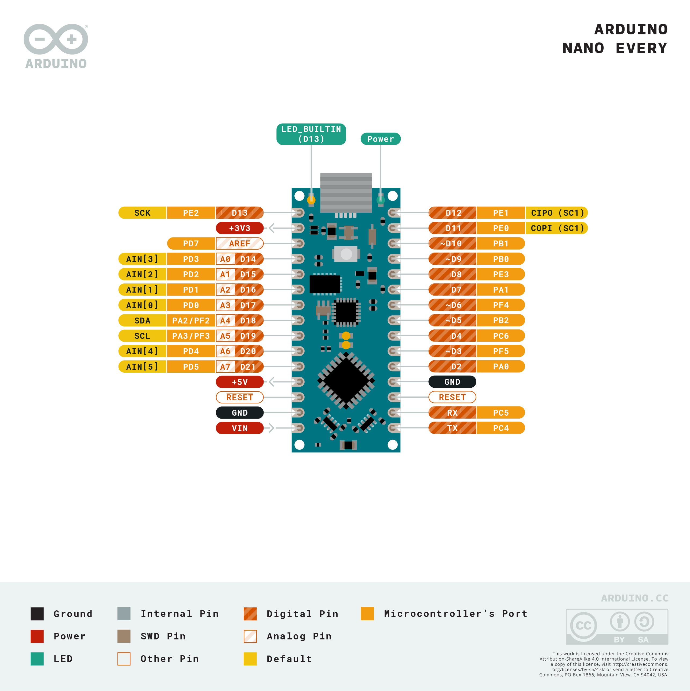

# Microcontroller code utilities

This repo contains code for a variety of microcontroller boards (e.g., Arduino,
Launchpad) and how they can interface with several different sensors and
modules.

## Getting started

To clone the repo from GitHub use:
```bash
git clone --recurse-submodules git@github.com:arpaiva/mcus.git
```

The `--recurse-submodules` arg is very important because
some of the libraries used herein are included as
[git submodules](https://git-scm.com/book/en/v2/Git-Tools-Submodules). 
In the event that one forgot to clone with submodules,
go into the repo directory and run the following two commands:
```bash
git submodule init
git submodule update
```
which will fetch all the data from the library repos and check out
the appropriate commit used against this repo.

## Board pinouts

### Arduino

<p>[Arduino Nano full pinout](pinouts/arduino_nano_full_pinout.pdf)</p>
